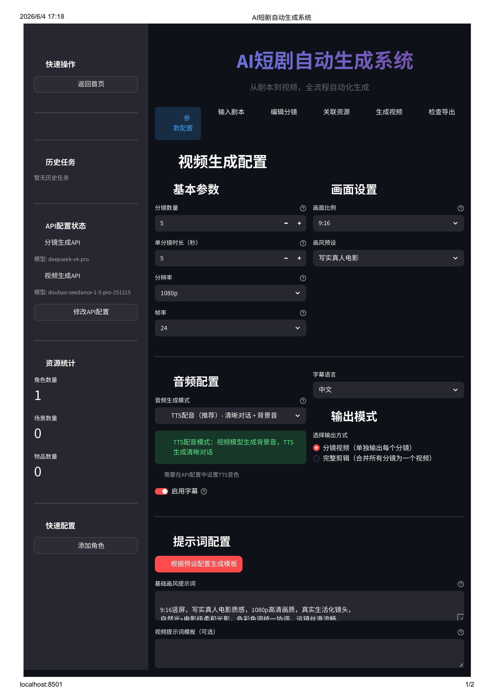
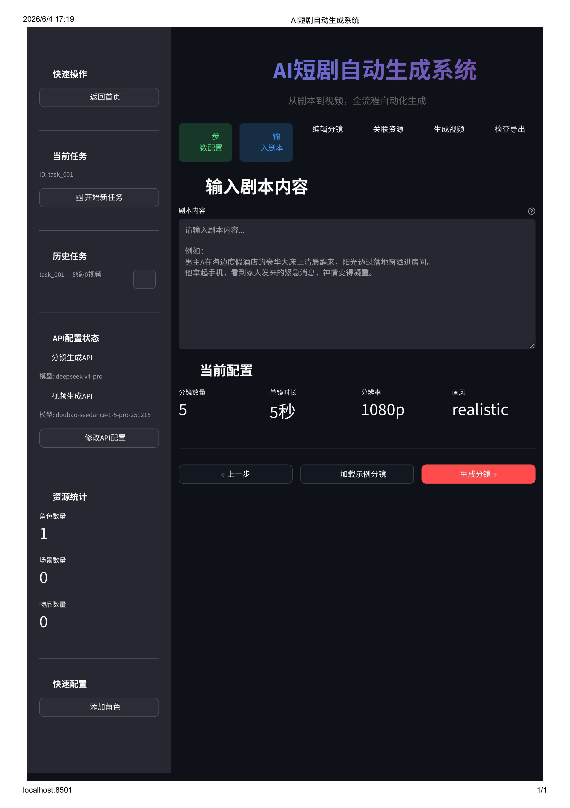
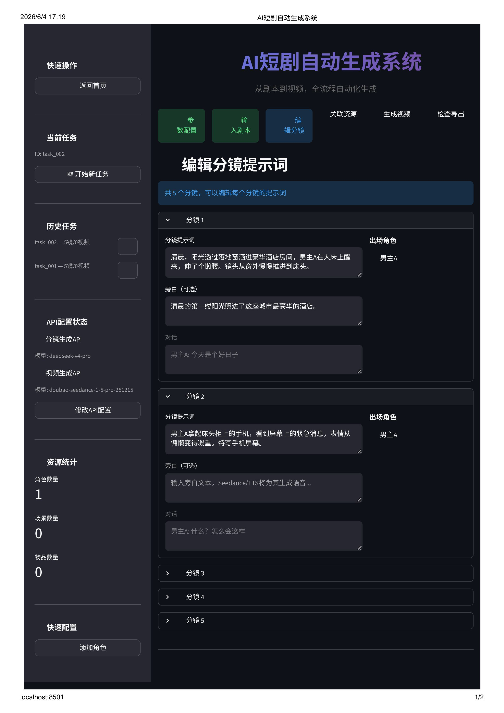
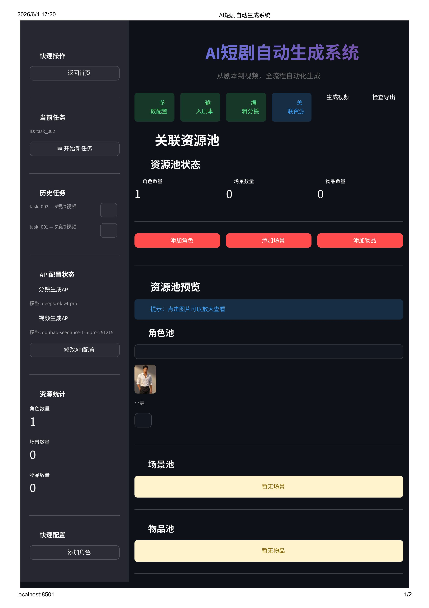
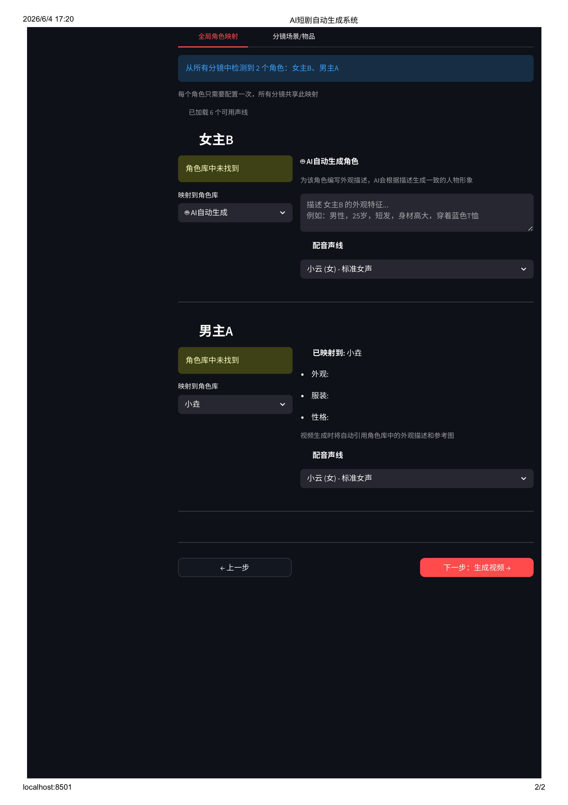
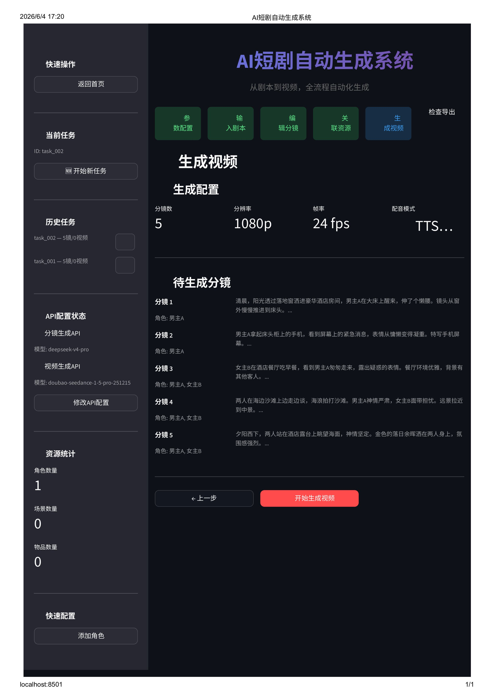

<p align="center">
  
  
  
  
</p>

<h1 align="center">🎬 AI 短剧自动生成系统</h1>

<p align="center">
  <strong>从剧本到视频，全流程 AI 自动化 — 零门槛创作专业级短剧</strong>
</p>

<p align="center">
  <a href="#-核心特性">核心特性</a> •
  <a href="#-系统架构">系统架构</a> •
  <a href="#-快速开始">快速开始</a> •
  <a href="#-配置指南">配置指南</a> •
  <a href="#-使用流程">使用流程</a> •
  <a href="#-项目结构">项目结构</a>
</p>

---

## ✨ 核心特性

<table>
<tr>
<td width="50%">

### 🤖 AI 智能分镜
- 输入剧本，AI 自动拆分为专业级分镜
- 自动提取角色、对话、旁白、镜头语言
- 支持 8 种画风预设（写实/动漫/赛博朋克/水彩/油画/卡通/科幻/奇幻）
- 分镜数据可手动编辑调整

</td>
<td width="50%">

### 🎥 视频自动生成
- 接入 Seedance API，文生视频一步到位
- 支持 **串行提交 + 并发轮询** 两阶段生成
- 断点续跑：已生成的视频自动跳过
- 单分镜独立重做，精准掌控每个镜头

</td>
</tr>
<tr>
<td width="50%">

### 🎭 资源池管理
- **角色池**：定义角色外观、服装、性格，附带参考图
- **场景池**：预设场景环境描述与参考图
- **物品池**：管理关键道具的外观信息
- **全局角色映射**：一次配置，所有分镜共享人脸一致性

</td>
<td width="50%">

### 🎤 TTS 智能配音
- 支持阿里云 / 讯飞 / Azure 三种 TTS 服务商
- 每个角色独立声线，100+ 可选音色
- 自动混合背景音 + TTS 对话
- 根据实际音频时长自动生成 SRT 字幕并烧录

</td>
</tr>
<tr>
<td width="50%">

### 🎨 多画风支持
- 写实真人电影 · 日系动漫 · 赛博朋克
- 水彩画 · 油画 · 卡通动画
- 科幻未来 · 奇幻魔幻
- 9:16 / 16:9 / 1:1 比例自由切换

</td>
<td width="50%">

### 📦 灵活输出
- **分镜模式**：每个分镜独立输出 MP4
- **合并模式**：自动合并为完整短剧
- 支持 480p ~ 4K 分辨率
- 24/30/60 fps 帧率可选

</td>
</tr>
</table>

---

## 🏗 系统架构

```
┌──────────────────────────────────────────────────────────────┐
│                    🎬 AI 短剧自动生成系统                       │
├──────────────────────────────────────────────────────────────┤
│                                                              │
│  Step 0        Step 1        Step 2        Step 3            │
│  ⚙️ 参数配置  →  📝 输入剧本  →  ✏️ 编辑分镜  →  🔗 关联资源    │
│  · 分辨率      · 剧本文本     · 提示词编辑   · 全局角色映射    │
│  · 帧率        · 示例加载     · 对话/旁白    · 场景选择        │
│  · 画风预设     · 历史剧本     · 角色调整     · 物品关联        │
│                                                              │
│                           ↓                                  │
│                                                              │
│  Step 4                       Step 5                        │
│  🎬 生成视频                   ✅ 检查导出                     │
│  · 进度追踪                   · 视频预览                      │
│  · 断点续跑                   · 单镜重做                      │
│  · TTS配音                    · 批量重做                      │
│  · 字幕烧录                   · 导出视频                      │
│                                                              │
├──────────────────────────────────────────────────────────────┤
│                         API 层                                │
│  ┌──────────────┐  ┌──────────────┐  ┌──────────────┐       │
│  │  DeepSeek    │  │  Seedance    │  │  Aliyun TTS  │       │
│  │  分镜生成     │  │  视频生成     │  │  语音合成     │       │
│  └──────────────┘  └──────────────┘  └──────────────┘       │
│                                                              │
├──────────────────────────────────────────────────────────────┤
│                       基础设施层                               │
│  ┌──────────┐ ┌──────────┐ ┌──────────┐ ┌──────────┐       │
│  │ FFmpeg   │ │ 角色池    │ │ 场景池    │ │ 物品池    │       │
│  │ 音视频    │ │ 外观管理  │ │ 环境管理  │ │ 道具管理  │       │
│  └──────────┘ └──────────┘ └──────────┘ └──────────┘       │
└──────────────────────────────────────────────────────────────┘
```

### 技术栈

| 层级 | 技术 |
|------|------|
| **前端 UI** | Streamlit（6 步骤向导式交互） |
| **分镜生成** | DeepSeek / Qwen LLM（通过阿里云 DashScope API） |
| **视频生成** | 火山引擎 Seedance API（doubao-seedance 系列） |
| **TTS 配音** | 阿里云百炼 TTS / 讯飞 / Azure |
| **音视频处理** | FFmpeg（混音、字幕烧录、视频合并） |
| **资源管理** | 本地 JSON 文件池（角色/场景/物品） |
| **任务管理** | 基于文件系统的任务隔离与断点续跑 |

---

## 📸 界面展示

### Step 0 — 参数配置
设置画风、分辨率、帧率、配音模式等全局参数。



### Step 1 — 剧本输入与分镜
粘贴剧本，AI 自动拆分为专业分镜，支持加载示例数据。



### Step 2 — 编辑分镜 & 视频生成
逐一审查编辑分镜提示词，一键启动批量视频生成，实时追踪进度。



### Step 3 — 资源池管理
管理角色池、场景池、物品池，配置参考图与外观描述。



### 全局角色映射 & 声线配置
将分镜角色映射到资源池，为每个角色选择独立配音声线。



### Step 4/5 — 视频预览与导出
预览生成的视频，支持单镜重做和导出完整短剧。



---

## 🚀 快速开始

### 环境要求

- **Python** 3.10+
- **FFmpeg**（音视频处理必需）

### 安装

```bash
# 1. 克隆仓库
git clone https://github.com/chiL314/AI-Short-Drama-Studio-.git
cd AI-Short-Drama-Studio-

# 2. 创建虚拟环境
python -m venv .venv
source .venv/bin/activate  # Linux/Mac
# .venv\Scripts\activate   # Windows

# 3. 安装 Python 依赖
pip install -r requirements.txt

# 4. 安装 FFmpeg
# Windows: 下载 ffmpeg.exe 放到项目根目录的 ffmpeg/bin/ 下
#          https://ffmpeg.org/download.html
# Mac:    brew install ffmpeg
# Linux:  sudo apt install ffmpeg

# 5. 配置 API 密钥
cp .env.example .env
# 编辑 .env 填入你的 API 密钥（详见配置指南）
```

### 启动

```bash
# 方式 1：命令行启动
streamlit run app.py

# 方式 2：Windows 双击启动
启动界面.bat
```

浏览器访问 **http://localhost:8501** 即可进入 Web 界面。

---

## ⚙️ 配置指南

### API 密钥配置

编辑项目根目录下的 `.env` 文件：

```bash
# ========== 大模型 API（分镜生成）==========
DEEPSEEK_API_KEY=sk-your-key-here
DEEPSEEK_API_URL=https://dashscope.aliyuncs.com/compatible-mode/v1/chat/completions
DEEPSEEK_MODEL=qwen3.5-flash

# ========== 视频生成 API ==========
SEEDANCE_API_KEY=ark-your-key-here
SEEDANCE_API_URL=https://ark.cn-beijing.volces.com/api/v3/contents/generations/tasks
SEEDANCE_MODEL=doubao-seedance-1-0-pro-250528

# ========== TTS 配音（可选）==========
TTS_PROVIDER=aliyun
TTS_ALIYUN_APPKEY=your-aliyun-appkey
TTS_ALIYUN_TOKEN=your-aliyun-token
```

> ⚠️ `.env` 已被 `.gitignore` 排除，不会提交到仓库。也可在 Web 界面中直接配置 API 密钥。

### 获取 API 密钥

| 服务 | 用途 | 获取地址 |
|------|------|----------|
| DeepSeek / Qwen | 剧本分镜生成 | [阿里云百炼平台](https://bailian.console.aliyun.com/) |
| Seedance | 视频生成 | [火山引擎 Ark](https://console.volcengine.com/ark/) |
| 阿里云 TTS | 语音合成 | [阿里云百炼平台](https://bailian.console.aliyun.com/) |

### 可选配置

```bash
# 调试模式：跳过 API 调用，仅输出 prompt 和 payload
DRY_RUN=true

# 资源池存储路径
RESOURCE_POOL_DIR=./resource_pool
```

---

## 📖 使用流程

### Step 0 — 参数配置
设置视频分辨率、帧率、画风预设（写实/动漫/赛博朋克等）、画面比例、配音模式、字幕开关。

### Step 1 — 输入剧本
粘贴剧本文本，设置分镜数量，AI 自动将剧本拆分为分镜。系统内置**示例分镜**可零 Token 测试完整流程。

### Step 2 — 编辑分镜
逐一审查和编辑每个分镜的提示词、对话和旁白，确保生成效果。

### Step 3 — 关联资源
- **全局角色映射**：将分镜中的角色名映射到资源池，AI 保证跨分镜外貌一致
- **场景选择**：为每个分镜指定场景环境
- **物品关联**：关联道具确保物品一致性
- **声线配置**：为每个角色选择独立的配音声线

### Step 4 — 生成视频
一键启动批量生成。系统会：
1. 串行提交所有分镜到 Seedance
2. 并发轮询视频生成结果
3. TTS 合成对话语音并混入视频
4. 自动生成字幕并烧录

断点续跑自动跳过已完成的视频。生成失败可单独重做。

### Step 5 — 检查导出
预览所有生成的视频，支持单镜重做、批量重做和导出。

---

## 📁 项目结构

```
ai-short-drama/
├── app.py                   # 🖥️  Streamlit Web 主界面（6 步骤向导）
├── config.py                # ⚙️  全局配置（API/画风/TTS/资源池）
├── script_processor.py      # 📝  剧本 → 分镜（LLM 调用 + 校验 + 角色注入）
├── video_generator.py       # 🎬  分镜 → 视频（Seedance API + TTS + 字幕）
├── audio_processor.py       # 🎵  FFmpeg 音视频处理（混音/合并/字幕烧录）
├── tts_service.py           # 🎤  TTS 配音服务（阿里云/讯飞/Azure）
├── character_pool.py        # 🎭  角色资源池管理
├── scene_pool.py            # 🎬  场景资源池管理
├── prop_pool.py             # 🎒  物品资源池管理
├── task_manager.py          # 📋  任务管理与断点续跑
├── utils/
│   ├── __init__.py
│   ├── image_utils.py       # 🖼️  图片处理（Base64 编码等）
│   └── logger.py            # 📊  日志模块
├── resource_pool/           # 📦  资源池数据（JSON）
│   ├── characters.json
│   ├── scenes.json
│   └── props.json
├── test/
│   └── sample_shots.json    # 🧪  示例分镜数据
├── .env.example             # 🔑  环境变量模板
├── requirements.txt         # 📦  Python 依赖
├── 启动界面.bat             # 🚀  Windows 一键启动脚本
└── build.bat                # 🔨  构建脚本
```

---

## 🎯 应用场景

- **短剧创作者**：快速将剧本概念转化为视频样片
- **内容营销**：批量生成品牌推广短视频
- **原型验证**：低成本验证剧本节奏与画面表现
- **教育教学**：文学剧本可视化教学辅助
- **个人创作**：零视频制作经验也能产出专业级短剧

---

## 🤝 贡献

欢迎提 Issue 和 PR！贡献前请阅读：

1. Fork 本仓库
2. 创建特性分支 (`git checkout -b feature/amazing-feature`)
3. 提交更改 (`git commit -m 'Add amazing feature'`)
4. 推送到分支 (`git push origin feature/amazing-feature`)
5. 创建 Pull Request

---

## 📄 许可证

本项目基于 MIT License 开源 — 详见 [LICENSE](LICENSE) 文件。

---

## ⚠️ 免责声明

本项目仅供学习和研究使用。使用本工具生成的视频内容，请确保遵守相关 API 服务商的使用条款及当地法律法规。使用者需对生成的内容承担全部责任。

---

<p align="center">
  <sub>Made with ❤️ by AI Short Drama Team</sub>
</p>
